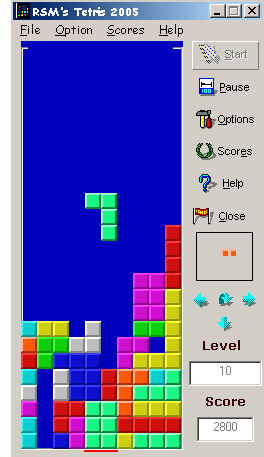



## Tetris 2005 Game Engine

### Description

Tetris '2005 is an exciting action game. Throughout the game, bricks of various types fall from the top to the bottom of the playing area. When the bricks form a solid row of blocks across the playing area, that row vanishes.

Because this is the only way to remove blocks, you should try to form solid rows whenever possible. The game ends when the pieces stack up to the top of the playing area.

You can manipulate a brick only when it is falling. Falling pieces may be rotated, moved horizontally, or dropped to the bottom of the playing area.

This nice and small game offers High score lists, Preview Screen, Position Pointer and more. It has no multimedia but intended to bring a taste of fun to a small break on a long, hard working day. However, if you would like to support my work, please rate this article and visit one of my other programs.

Check them out!
 
### More Info
 

             |
---                |---
**Submitted On**   |2005-08-08 05:28:30
**By**             |[Mohit Soam](https://github.com/Planet-Source-Code/PSCIndex/blob/master/ByAuthor/mohit-soam.md)
**Level**          |Intermediate
**User Rating**    |4.9 (39 globes from 8 users)
**Compatibility**  |VB 6\.0
**Category**       |[Games](https://github.com/Planet-Source-Code/PSCIndex/blob/master/ByCategory/games__1-38.md)
**World**          |[Visual Basic](https://github.com/Planet-Source-Code/PSCIndex/blob/master/ByWorld/visual-basic.md)
**Archive File**   |[Tetris\_200192211872005\.zip](https://github.com/Planet-Source-Code/mohit-soam-tetris-2005-game-engine__1-62120/archive/master.zip)

